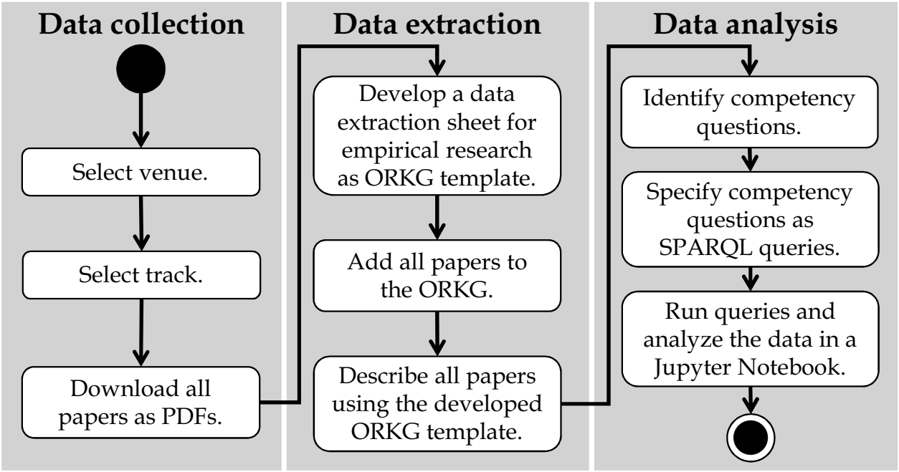

# Analysis of the State and Evolution of Empirical Research in Requirements Engineering
The project contains an analysis of the state and evolution of empirical research in requirements engineering and is supplementary material for the paper "*Divide and Conquer the EmpiRE: A Community-Maintainable Knowledge Graph of Empirical Research in Requirements Engineering*", submitted to the [17th ACM/IEEE International Symposium on Empirical Software Engineering and Measurement](https://conf.researchr.org/home/esem-2023).

<!--Binder link to the interactive, reproducible and reusable analysis:
--> 

## Background
Empirical research in Requirements Engineering (RE) is a constantly evolving topic. Over the years, several publications examined how empirical research in RE is conducted and how it should be conducted in the future by presenting snapshots of the "current" state of empirical research in RE and, more generally, in Software Engineering (SE). These researchers share the same goal of synthesizing a comprehensive, up-to-date, and long-term available overview of the state and evolution of empirical research in RE and SE. Although they share the same goal, use similar methods, i.a., (systematic) literature reviews, and even examine overlapping periods, venues, and themes, they have not collaborated to build on and update earlier works. **Lack of collaboration among researchers** and **updating literature revuews** are two well-known challenges of literature reviews. Overcoming these challenges is critical to ensure the quality, reliability, and timeliness of research findings from literature reviews.

## Motivation
Recent research addresses the above challenges by focusing on when and how to update (systematic) literature reviews in SE and its subfields. While these works provide social and economic decision support and guidance for updating literature reviews, **the central problem is the unavailability of the extracted and analyzed data**, corresponding to open science in SE. Unavailable data complicates **collaboration among researchers** and **updating literature reviews** as the entire data collection, extraction, and analysis must be repeated and expanded for a comprehensive review. Researchers need support in the form of technical infrastructures and services to conduct sustainable literature reviews so that all data is openly available in the long term according to the FAIR data principles (Findable, Accessible, Interoperable, and Reusable). For this purpose, the data must be organized in a flexible, fine-grained, context-sensitive, and semantic representation to be understandable, processable, and usable by humans and machines. Over the last decade, Knowledge Graphs (KGs) have become an emerging technology in industry and academia as they enable this versatile data representation. Besides well-known KGs for encyclopedic and factual data, such as [DBpedia](https://www.dbpedia.org/) and [WikiData](https://www.wikidata.org), using so-called Research Knowledge Graphs (RKGs) for scientific data is a rather new approach. RKGs include bibliographic metadata, e.g., titles, authors, and venues, as well as scientific data, e.g., research designs, methods, and results. They are a promising technology to sustainably organize scientific data so that the data is openly available for long-term collaborations.

## Aims
**Our longterm objective is to constantly maintain a KG of empirical research in RE (KG-EmpiRE) with the research community to synthesize a comprehensive, up-to-date, and long-term available overview of the state and evolution of empirical research in RE**. For this purpose, we examine the use of RKGs as technical infrastructure for building and publishing an initial KG-EmpiRE, that the research community can constantly maintain, (re-)use, update, and expand by *dividing* the efforts to *conquer* the EmpiRE. In particular, we use the Open Research Knowledge Graph ([ORKG](https://orkg.org/)), a cross-domain and cross-topic RKG with services using that combine manual crowdsourcing and automated approaches to organize scientific data. With this work, we lay the foundation for such a comprehensive, up-to-date, and long-term available overview of the state and evolution of empirical research in RE by building, publishing, and evaluating the initial KG-EmpiRE.

## Method

    
    

    <em>Research approach for building, publishing, and evaluating the initial KG-EmpiRE.</em>

Our research approach consists of three steps: Data collection, Data extraction, and Data analysis. So far, **we collected 570 papers** published in the research track of the [IEEE International Requirements Engineering Conference](https://ieeexplore.ieee.org/xpl/conhome/1000630/all-proceedings) from 2000 to 2022. **We extracted and organized their scientific data**, i.a., research paradigm, research design, empirical method (data collection and data analysis), and bibliographic metadata using a developed [ORKG template](https://orkg.org/template/R186491). ORKG templates are an implementation of a subset of SHACL and allow specifying the structure of descriptions of papers. In this way, we determined which data to extract and ensured that all the descriptions of papers are consistent and comparable to **build and publish the initial KG-EmpiRE**.

In this Jupyter Notebook, we perform the data analysis of the KG-EmpiRE, which has two purposes:

(1) We evaluate the coverage of the curated topic of empirical research in RE by the initial KG-EmpiRE.

(2) We get initial insights into the state and evolution of empirical research in RE.

The data analysis is based on competency questions regarding empirical research in SE, including RE, derived from the vision of [Sjøberg et al. (2007)](https://doi.org/10.1109/FOSE.2007.30). [Sjøberg et al. (2007)](https://doi.org/10.1109/FOSE.2007.30) describe their vision of the role of empirical methods in SE, including RE, for the period of 2020 – 2025 by comparing the **"current" state of practice (2007)** with their **target state (2020 - 2025)**. We analyzed these descriptions and derived a total of [77 competency questions](competency-questions.xlsx). The number of competency questions answered reflects the **coverage of the curated topic in KG-EmpiRE** (1), and the answers to competency questions provide **initial insights into the curated topic** (2). For each competency question that could be answered with KG-EmpiRE, we specified the a [SPARQL](https://www.w3.org/TR/sparql11-query/) query to retrieve and analyze the data from the [ORKG](https://orkg.org/).

## Results
**Coverage:**

Regarding the coverage of the curated topic by the initial KG-EmpirE, we can state that we are able to answer 16 of the 77 competence questions (21%) using the extracted data. While this number of answered competency questions represents an acceptable coverage of the curated topic, the need to expand the [ORKG template](https://orkg.org/template/R186491) to extract and organize more data required to answer the open competency questions is clearly evident. However, we did not focus on building and publishing an already comprehensive KG of empirical research in RE that can be used to answer as many competency questions as possible. Instead, we aimed to lay its foundation by building, publishing, and evaluating the initial KG-EmpiRE. We focused on conducting a literature review to illustrate how researchers can use RKGs, specifically the ORKG, as a technical infrastructure for organizing scientific data in an openly available and long-term way to build and publish KGs that the research community can constantly maintain, (re-)use, update, and expand.

**State and evolution of empirical research in RE:**

Regarding the state and evolution of empirical research in RE by analyzing the KG-EmpiRE, we can report a positive development towards the vision of [Sjøberg et al. (2007)](https://doi.org/10.1109/FOSE.2007.30). We found that the proportion of papers with an empirical study increases over time with a average proportion of 94.3% for the **target state (2020 - 2025)**. For data collection, researchers frequently and constantly use the established empricial methods *experiment*, *secondary research*, and *survey* with average proportions of 35.7% (*experiment*), 40% (*secondary research*), and 18.7% (*survey*) for the **target state (2020 -2025)**. We also found that the use of the empirical method *case study*, whose increased use is envisioned, decreases over time with a proportion of 22.3% for the **target state (2020 - 2025)**. Despite the decrease, the emprical method *case study* is actually used more frequently than surveys on average in the **target state (2020 - 2025)**. Furthermore, this decrease represents a positive development of the empirical research in RE, as researchers seem to be more aware of the definition of a case study and therefore use the term more purposefully than in the past. This finding is consistent with the conclusion of [Wohlin](https://doi.org/10.1016/j.infsof.2021.106514) who stated that the term *case study* is often misused in software engineering. Consequently, empirical research that is called as a *case study* in recent years appears to actually be a *case study*. For data analysis, researchers mainly and constantly use *descriptive statistics* with a proportion of 87.6% overall and 92% for the **target state (2020 - 2025)**. In contrast, the use of *inferential statistics* with a proportion of 19.2% overall and 26.3% for the **target state (2020 - 2025)** is small. Regarding the general use of empirical methods, we found that the number of empirical methods used for data collection and data analysis in a single papers increases over time, with *three to four empirical methods* most frequently used in one paper. For the **target state (2020 - 2025)**, researchers mainly use *three to even five empirical methods* in a single paper with average proportions of 22% (*three empirical methods used*), 25.3% (*four empirical methods used*), and 26.7% (*five empirical methods used*). This increase in the number of empirical methods used shows a shift as envisioned towards the use of several empirical methods and thus the collection and analysis of data from different perspectives to synthesize evidence. In addition to the empirical methods used, we also found a positive development with regard to the reporting of important information of experimental design. For the **target state (2020 - 2025)**, the proportion of papers reporting *threats to validity*, providing *raw data and supplementary materials*, and highlighting their *research questions and answers* steadily increase over time with average proportions of 91.3% (*threats to validity*), 71.3% (*raw data and supplementary materials*), and 23.7% (*highlighted research questions and answer*) respectively 53% (*highlighted research question and answer hidden in the running text*). 

Despite the positive developments towards the vision of [Sjøberg et al. (2007)](https://doi.org/10.1109/FOSE.2007.30), we also identified the need for future improvements of empirical research in RE. While [Sjøberg et al. (2007)](https://doi.org/10.1109/FOSE.2007.30) envisioned an increased use of *action research, we found that the proportion of *action research* is small over the entire timeframe analyzed (2000 - 2022) with an average proportion of only 2%. For the **target state (2020 - 2025)**, no paper reported the use of *action research*. According to [Sjøberg et al. (2007)](https://doi.org/10.1109/FOSE.2007.30), more *case studies* and *action research* are needed to ensure the industrial relevance of empirical research. This part of the vision is not yet nearly achieved. Regarding the reporting of threats to validity, we found two issues for future improvement. First, a proportion of 33.6% of the analyzed papers reporting threats to validity *only mentioned threats to validity* without any further classification of the types of validity. Although the general reporting of threats to validity is useful, the lack of classification of the reported threats to validity makes it difficult for a reader to have a clear overview of whether the threats to validity have been discussed comprehensively. In the future, researchers need to communicate their threats to validity comprehensively and transparently by discussing all type of validity equally and naming the type of validity addressed. Second, the proportion of papers reporting threats to *conclusion validity* with 18.2% is small compared to the other mainly discussed types of valdity (*external validity*: 60.4%, *internal validity*: 56.1%, and *construct validity*: 47.9%). Therefore, researchers need to make more effort to comprehensively discuss the validity of their empirical research by also addressing the conclusion valditiy similar to the other types of validity. Regarding data analysis, the proportion of paper using *inferential statistics* is small with a proportion of only 26.2% for the **target state (2020 - 2025)**. For a mature use of statistical methods as envisioned by [Sjøberg et al. (2007)](https://doi.org/10.1109/FOSE.2007.30), researchers have to deal more with *inferential statistics* and include them in the data analysis of their empirical research.

## Conclusions
First of all, we want to remark that the generalizability of our findings is limited as KG-EmpiRE is in an initial stage due to the limited analysis of the 570 papers from the research track of the [IEEE International Requirements Engineering Conference](https://ieeexplore.ieee.org/xpl/conhome/1000630/all-proceedings) from 2000 to 2022. This conference is the largest international conference in the research field of RE where a large number of established researchers in this field regularly publish high-quality, peer-reviewed (empirical) research papers. Therefore, the papers analyzed are a representative for the target population of all papers in RE, but they still form only a small subset. Nevertheless, the results provide important insights into the state and evolution of empirical research in RE published in [IEEE International Requirements Engineering Conference](https://ieeexplore.ieee.org/xpl/conhome/1000630/all-proceedings). For this reason, we consider the current scope of our literature review to be appropriate to llustrate how researchers can use RKGs, specifically the ORKG, as a technical infrastructure for organizing scientific data in an openly available and long-term way to build and publish KGs that the research community can constantly maintain, (re-)use, update, and expand, thus enabling sustainable literature reviews.

Using the ORKG, the extracted data is not encapsulated in a file as usual, which is, at best, published on a data repository, but in a openly available knowledge graph, which, to put it simply, is nothing more than a graph-based database. Overall, the ORKG offers an ready-to-use and sustainably governed infrastructure that implements best practices, such as FAIR principles and versioning, with services to support researchers in organizing (acquiring, curating, publishing, and processing) FAIR scientific data. As a result, the FAIR scientific data is openly available in the long term and can be understood, processed, and used by humans and machines. Thus, the research community can constantly maintain, (re-)use, update, and expand the initial KG-EmpiRE, that we have built, published, evaluated, in a long-term and collaborative manner. For example, in case of errors in data extraction, anyone, and in the best case the authors themselves, can update the data. It is also possible to expand the KG-EmpiRE by curating more papers using or even expanding the [ORKG template](https://orkg.org/template/R186491) to extract more data in a structured, consistent, and comparable way. In all these cases, anyone can (re-)use this Jupyter Notebook to reproduce the data analysis and its (updated) results. Using RKGs to organize scientific data helps to address two of the key challenges of literature reviews: **Lack of collaboration among researchers** and **updating literature reviews**. For this reason, we conclude that using RKGs represents a step in the right direction towards sustainable literature reviews to ensure the quality, reliability, and timeliness of research findings for a successful long-term collaboration of researchers.

For our future work, we have a plan with short-, mid-, and long-term actions. As short-term actions, we expand KG-EmpiRE by describing more papers of the [IEEE International Requirements Engineering Conference](https://ieeexplore.ieee.org/xpl/conhome/1000630/all-proceedings) with our [ORKG template](https://orkg.org/template/R186491). Our goal over the coming months is to cover the entire research track of the [IEEE International Requirements Engineering Conference](https://ieeexplore.ieee.org/xpl/conhome/1000630/all-proceedings) from 1994 - 2022 to get a comprehensive overview of the state and evolution of empirical research in RE at this conference. We also establish a more general [ORKG observatory](https://orkg.org/observatory/Empirical_Software_Engineering) as a central access point to all curated papers. The observatory is an open group that anyone can join to contribute to the topic. As mid-term actions, we write and publish an [ORKG review](https://orkg.org/about/16/Reviews) about the state and evolution of empirical research in RE, based on the complete collection of all papers from the research track of the [IEEE International Requirements Engineering Conference](https://ieeexplore.ieee.org/xpl/conhome/1000630/all-proceedings) from 1994 - 2022. An [ORKG review](https://orkg.org/about/16/Reviews) is a special kind of literature review article that the research community can constantly maintain when underlying content in the ORKG changes due to updates or expansions. Besides the [ORKG review](https://orkg.org/about/16/Reviews), we expand the KG-EmpiRE by including more papers from other important venues, such as the journal [Requirements Engineering](https://link.springer.com/journal/766/volumes-and-issues) or the [International Working Conference on Requirement Engineering: Foundation for Software Quality](https://link.springer.com/conference/refsq), to gain a more comprehensive overview of the state and evolution of empirical research in RE. As long-term action, we extend the [ORKG template](https://orkg.org/template/R186491) to organize more extensive scientific data about empirical resarch in a structured, consistent, and comparable manner and thus to address the 61 still open [competency questions](competency-questions.xlsx). With this plan, we work towards maintaining, updating, and expanding the initial KG-EmpiRE togehter with the research community by *dividing* the efforts to *conquer* the EmpiRE.
